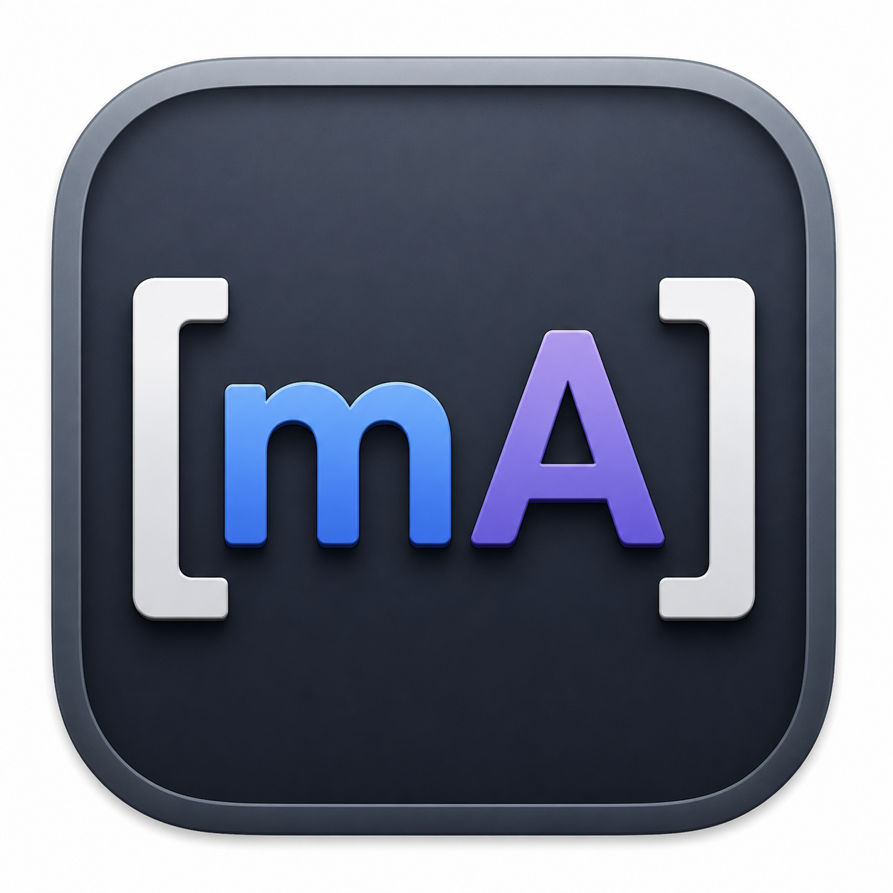
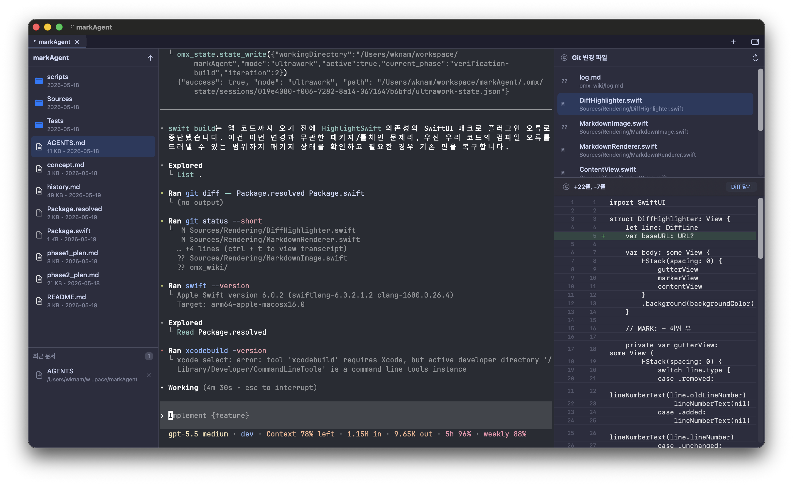

<p align="center">
  
</p>

# MarkAgent

**A native macOS developer tool that brings Ghostty-based multi-tab terminals and a Markdown workspace into one app.**

한국어 설명은 [아래 섹션](#korean-readme)에서 볼 수 있습니다.

## Read This First

This repository is not a finished, general-purpose OSS product or a factory-style project that keeps accepting PRs to add every requested feature. It is a macOS AI development tool built around my own working environment. The reason it is public is closer to "study the work history and implementation parts, then fork it and reshape it with AI for your own environment" than "install this as-is and expect it to fit everyone."

That means general UX requests such as settings screens, Windows/Linux support, support for a specific `tmux` setup, or compatibility with someone else's personal workflow are not project priorities. If you need those things, fork it, change it, remove pieces, add pieces, and make it yours.

**Fork welcome over PR welcome. Issues are mainly for bug reports and implementation references.**

MarkAgent is a macOS app that gathers the screens you need when developing with CLI-based AI agents such as Codex CLI, Claude Code, and Gemini CLI. You can run agents in Ghostty terminal tabs, browse files in the active working directory, and edit or preview Markdown documents created or modified by the agent in the same window.



## Concept

CLI-based AI agents feel most natural in a terminal, but real development often needs more than a terminal. You need to scan changed files, read Markdown output in a readable format, and sometimes edit and save it immediately.

MarkAgent is a visual bridge for that workflow.

- Run AI agents and ordinary CLI tools in Ghostty-based multi-tab terminals.
- Browse files from the current working directory in the sidebar and open Markdown files directly.
- Switch between raw Markdown editing and GitHub Flavored Markdown preview.
- Inspect Git changed files and diffs inside the app to track agent output.
- Keep the terminal-centered workflow while adding a native GUI for reading and review-heavy screens.

## Features

- **Ghostty terminal tabs:** Embedded terminal tabs powered by `libghostty-spm` for handling multiple work sessions in one window. Inactive terminal tabs are marked as hidden to reduce unnecessary Ghostty Metal redraw work and lower energy usage when multiple sessions are open.
- **Ghostty config integration:** Reads `~/.config/ghostty/config` and reflects your existing terminal preferences such as theme, font family, and font size in the app. The Settings tab groups Ghostty theme preview cards into light and dark sections, lets you choose font size, coding font, and fallback font with live previews, and defaults the fallback font to Apple SD Gothic Neo when only a primary coding font is configured; changes are saved back to the Ghostty config file and immediately reloaded into open terminal tabs. It also checks Ghostty's macOS Application Support config path, lets you re-read the current config from the MarkAgent menu, opens the current Ghostty config file directly from the app menu, reloads the live terminal configuration after saving that file, and restores action-aware Ghostty keybind dispatch so `text:` payloads and binding actions take the intended path.
- **Markdown editing and preview:** Supports raw Markdown editing, GFM rendering, tables, checklists, strikethrough, highlighted code blocks, and a local markdown toolbar with preview/raw mode switching plus inline formatting actions. Wide markdown tables can be scrolled horizontally, table columns keep clearer separators, and preview memory is released more aggressively when returning to raw edit. When the opened file is not Markdown, markdown-only editing controls stay hidden so raw text files keep a cleaner editor UI.
- **Close confirmation:** Closing a terminal tab asks for confirmation, and closing a modified Markdown document lets you save, discard changes, or cancel.
- **Working directory file browser:** Updates the file browser based on the active terminal or Markdown tab's working directory, and both left and right sidebars can be resized directly in the window. The left file sidebar can be toggled from the toolbar or View menu, with Settings options for default visibility and one-click preview. When one-click preview is enabled, selecting a file uses the full left sidebar as a focused preview surface while terminal tabs keep running independently; the preview can be closed with the back button or with Esc only when the preview itself has focus, and the edit button opens the file in a tab. Image previews are downsampled and text previews are capped so large files do not spike memory just to fill the sidebar.
- **Change tracking:** Shows changed files from the Git repository in the sidebar with per-file `+/-` line counts, supports single-click branch checkout and Git init from the titlebar, keeps the full current branch name visible in the titlebar, and opens a GitHub-style Files changed tab that displays all changed file diffs in one scrollable view. The right sidebar can stay open outside Git repositories and switch between changed files and saved prompt snippets. Changed files open an in-sidebar diff preview with one click, the preview can be promoted to the full diff tab, and selecting a file while the diff tab is open scrolls that tab to the file's section.
- **About and licenses:** Opens About as an in-app tab with app version, repository link, and open source package attribution, including original authors and clickable repository links.
- **Bundled help:** Opens the bundled `README.md` from the Help menu inside a MarkAgent Markdown tab, so the app can show its project documentation even when the local checkout is not available.
- **Recent documents:** Reopen frequently used Markdown documents from the recent documents list.
- **App launch file opening:** Opening the app with a file path, including `.app --args` launches, resolves the target file directly into a markdown tab.
- **English and Korean interface:** Uses English as the default UI language and switches to Korean through macOS localization resources, covering menus, sidebars, Git/Diff screens, snippets, settings, About, and document prompts.
- **macOS app bundle:** Runs as a `.app` bundle with Dock, menu bar, Cmd+Tab, and normal macOS window behavior.

## Terminal Workflow

MarkAgent is not trying to replace your terminal. It embeds the terminal experience through Ghostty and is designed to work alongside proven CLI tools.

- Use `tmux` if you need a multiplexer.
- Keep using advanced CLI editors such as `vim`, `nvim`, or `emacs`.
- Run Git, builds, tests, package managers, and AI agents in terminal tabs.
- Let MarkAgent's GUI assist with Markdown output, change review, and working directory browsing.

## tmux cwd Troubleshooting

The Diff button is enabled only when MarkAgent knows that the active working directory is inside a Git repository. Normal shells can report cwd changes to Ghostty through OSC 7, but tmux may block or fail to forward those updates. MarkAgent accepts regular paths and `file://` OSC 7 paths, ignores invalid cwd updates, and keeps the previous valid directory instead of switching the sidebar to a broken path.

Add passthrough support to `~/.tmux.conf`:

```tmux
# Allow shell integration inside tmux to pass OSC sequences such as OSC 7
# working-directory updates through to Ghostty/MarkAgent.
set -g allow-passthrough on
```

Apply it to a running tmux server:

```bash
tmux source-file ~/.tmux.conf
```

Then make your shell emit OSC 7 on prompt and directory changes. For zsh, add this to `~/.zshrc`:

```zsh
# MarkAgent/Ghostty: report cwd changes, including from inside tmux.
__markagent_osc7_cwd() {
  emulate -L zsh
  local host="${HOST:-$(hostname)}"

  if [[ -n "$TMUX" ]]; then
    printf '\ePtmux;\e\e]7;file://%s%s\a\e\\' "$host" "$PWD"
  else
    printf '\e]7;file://%s%s\a' "$host" "$PWD"
  fi
}

autoload -Uz add-zsh-hook
add-zsh-hook chpwd __markagent_osc7_cwd
add-zsh-hook precmd __markagent_osc7_cwd
```

Reload the shell inside the tmux pane and move directories again:

```bash
source ~/.zshrc
cd ~
cd ~/workspace/markAgent
```

If the cwd still does not reach MarkAgent, try `set -g allow-passthrough all` in `~/.tmux.conf`. The `on` value should be enough for visible panes, while `all` also allows passthrough from invisible panes.

## Built for AI Agent Development

MarkAgent focuses on making AI agent work history and outputs easier for humans to review.

- See files modified by the agent directly in the Git change list.
- Read plans, reviews, reports, and work logs written in Markdown through the preview.
- Edit and save documents directly in Raw Edit mode when needed.
- The repository may include agent-oriented work history and project guides, which help fork authors understand the surrounding context.

## Build and Usage

This repository is set up so you can freely fork it, build it, and adapt it to your own development environment.

Requirements:

- macOS 14 Sonoma or later
- Swift 6.0 or later

Build:

```bash
swift build
```

Create the macOS app bundle:

```bash
scripts/bundle.sh
```

Create a release bundle:

```bash
scripts/bundle.sh release
```

Release builds are intended for maintainers with a Developer ID certificate and Apple notarization credentials. The script signs, notarizes when credentials are configured, creates `MarkAgent-v<version>.zip` with `ditto`, verifies the extracted app, and prints the SHA-256 checksum.

```bash
MARKAGENT_NOTARY_PROFILE="notarytool-profile" scripts/bundle.sh release
```

For local unsigned testing only:

```bash
MARKAGENT_CODESIGN=0 scripts/bundle.sh release
```

Install the app bundle to `~/Applications`:

```bash
scripts/bundle.sh install
```

If a locally built macOS app does not open because it is still marked as quarantined, remove the quarantine attribute:

```bash
xattr -dr com.apple.quarantine /Applications/MarkAgent.app
```

Open a Markdown file with the app bundle:

```bash
open .build/MarkAgent.app --args README.md
```

Project-local release automation for maintainers:

```text
/release-build
```

If no version is provided, the project-local command under `.claude/commands/release-build.md` reads the current app version and bumps the patch number automatically.

## Ghostty Config

MarkAgent looks for Ghostty config files in this order:

1. `~/.config/ghostty/config`
2. `~/Library/Application Support/com.mitchellh.ghostty/config`

The current implementation reads `font-family`, `font-size`, `theme`, `background`, `foreground`, `cursor-color`, `selection-background`, `selection-foreground`, and `palette`, then applies those values to the terminal and app theme.

## Open Source

MarkAgent uses the following open source libraries.

- `swift-markdown` - Apache-2.0
- `swift-cmark` - BSD-style and MIT notices
- `HighlightSwift` - MIT, bundled `highlight.js` is BSD-3-Clause
- `libghostty-spm` - MIT, bundled `libghostty` follows its own license terms
- `MSDisplayLink` - MIT

## Repository

https://github.com/dspaudio/markAgent

---

<a id="korean-readme"></a>

<p align="center">
  
</p>

# MarkAgent

**Ghostty 기반 멀티탭 터미널과 마크다운 작업 공간을 하나로 묶은 macOS 네이티브 개발 도구.**

## 먼저 읽어 주세요

이 저장소는 완성형 범용 OSS 제품이나 PR을 받아 기능을 계속 붙이는 공장형 프로젝트가 아닙니다. 제 작업 환경에 맞춰 만든 macOS용 AI 개발 도구이며, 공개 목적은 "그대로 설치해서 모두가 똑같이 쓰세요"가 아니라 "작업 내역과 구현 부품을 보고, 자기 환경에 맞게 포크해서 AI로 개조하세요"에 가깝습니다.

그래서 설정 화면, Windows/Linux 지원, 특정 `tmux` 구성, 개인 워크플로우 호환성 같은 일반 UX 민원은 프로젝트의 우선순위가 아닙니다. 필요하면 포크해서 고치고, 바꾸고, 덜어내고, 붙여서 쓰면 됩니다.

**PR welcome보다는 Fork welcome. 이슈는 버그 리포트와 구현 참고용으로만 봅니다.**

MarkAgent는 Codex CLI, Claude Code, Gemini CLI 같은 CLI 기반 AI 에이전트로 개발할 때 필요한 작업 화면을 macOS 앱 안에 모아 둔 도구입니다. Ghostty 터미널 탭에서 에이전트를 실행하고, 같은 창에서 작업 경로의 파일을 확인하며, 에이전트가 생성하거나 수정한 Markdown 문서를 바로 편집하고 미리 볼 수 있습니다.


## 컨셉

CLI 기반 AI 에이전트는 터미널에서 가장 자연스럽게 동작하지만, 실제 개발 중에는 터미널만으로 부족한 순간이 많습니다. 변경된 파일을 훑어보고, Markdown 결과물을 읽기 좋은 형태로 확인하고, 필요하면 바로 고쳐 저장해야 합니다.

MarkAgent는 이 흐름을 위해 만든 비주얼 브릿지입니다.

- Ghostty 기반 멀티탭 터미널에서 AI 에이전트와 일반 CLI 도구를 실행합니다.
- 작업 경로의 파일 목록을 사이드바에서 확인하고 Markdown 파일을 바로 엽니다.
- Markdown 원문 편집과 GitHub Flavored Markdown 미리보기를 전환합니다.
- Git 변경 파일과 Diff를 앱 안에서 확인해 AI 에이전트의 작업 결과를 추적합니다.
- 터미널 중심 워크플로우는 유지하되, 읽기와 검토가 필요한 화면만 네이티브 GUI로 보강합니다.

## 주요 기능

- **Ghostty 터미널 탭:** `libghostty-spm`을 사용한 내장 터미널 탭으로 여러 작업 세션을 한 창에서 다룹니다. 비활성 터미널 탭은 숨김 surface로 표시해 여러 세션을 열어 둔 상태에서 불필요한 Ghostty Metal 재렌더링과 에너지 사용을 줄입니다.
- **Ghostty 설정 연동:** `~/.config/ghostty/config`를 읽어 테마, 폰트 패밀리, 폰트 크기 등 기존 터미널 취향을 앱에 반영합니다. Settings 탭은 Ghostty 테마 미리보기 카드를 라이트/다크 섹션으로 나눠 보여주고, 폰트 크기, 코딩 폰트, fallback 폰트를 실시간 미리보기로 고를 수 있습니다. 코딩 폰트만 설정된 경우 fallback 폰트는 기본적으로 Apple SD Gothic Neo를 사용합니다. Ghostty의 macOS Application Support 설정 경로도 함께 확인하며, 설정된 Ghostty keybind chord도 raw text 주입이 아니라 Ghostty 자체 키 처리 경로로 전달합니다. MarkAgent 메뉴의 Reload Configuration으로 현재 설정을 다시 읽을 수 있고, Open Ghostty config 메뉴로 현재 설정 파일을 바로 열어 저장 후 실행 중 터미널 설정에 다시 반영할 수도 있습니다.
- **Markdown 편집 및 미리보기:** Markdown 원문 편집, GFM 렌더링, 표, 체크리스트, 취소선, 코드 블록 하이라이팅을 지원하고, 로컬 상단 툴바에서 Preview/Raw Edit 전환과 기본 서식 액션을 제공합니다. 넓은 표는 가로 스크롤할 수 있고, 표 컬럼 구분선이 더 명확하게 보이며, Raw Edit로 돌아갈 때 Preview 메모리를 더 적극적으로 반환합니다. Markdown이 아닌 파일을 열면 마크다운 전용 편집 아이콘은 숨겨져 raw text 편집 화면이 더 단순하게 유지됩니다.
- **닫기 확인:** 터미널 탭을 닫을 때 확인창을 표시하고, 수정 중인 Markdown 문서를 닫을 때는 저장, 변경 취소, 닫기 취소를 선택할 수 있습니다.
- **작업 경로 파일 확인:** 활성 터미널이나 Markdown 탭의 작업 경로에 맞춰 파일 브라우저를 갱신하며, 좌우 사이드바를 직접 리사이즈할 수 있습니다. 왼쪽 파일 사이드바는 툴바나 View 메뉴에서 토글할 수 있고, Settings에서 기본 표시 여부와 원 클릭 미리보기를 설정할 수 있습니다. 원 클릭 미리보기를 켜면 파일 선택 시 왼쪽 사이드바 전체가 포커스 가능한 미리보기 화면으로 바뀌고 터미널 탭은 독립적으로 계속 동작합니다. 미리보기는 뒤로가기 버튼으로 닫을 수 있으며, 미리보기에 포커스가 있을 때만 Esc로 닫히고 편집 버튼을 누르면 파일을 탭으로 엽니다. 이미지 미리보기는 썸네일로 다운샘플링하고 텍스트 미리보기는 앞부분만 읽어 큰 파일을 사이드바에 표시할 때 메모리가 튀지 않도록 했습니다.
- **변경사항 추적:** Git 저장소의 변경 파일을 사이드바로 보고, 선택한 파일의 줄 단위 Diff를 확인하며, 숨겨진 문맥은 단계적으로 더 펼쳐볼 수 있습니다. 변경 파일 목록을 새로고침해도 해당 파일이 계속 변경된 상태라면 선택한 Diff를 유지합니다. 우측 사이드바는 Git 저장소 밖에서도 열 수 있고, 변경 파일 탭과 저장된 프롬프트 스니펫 탭을 전환할 수 있습니다. 변경 파일은 단일 클릭으로 우측 사이드바 안에서 Diff를 미리 보고, 필요할 때 전체 Diff 탭으로 승격할 수 있으며, Diff 탭이 열린 상태에서 파일을 선택하면 해당 파일 섹션으로 스크롤합니다. 타이틀바에서는 Git 브랜치 전환과 Git Init도 처리할 수 있으며 브랜치는 한 번 클릭으로 전환합니다.
- **About 및 라이선스:** About을 앱 내부 탭으로 열고 앱 버전, 저장소 링크, 오픈소스 패키지별 원 저작자와 클릭 가능한 저장소 링크를 표시합니다.
- **번들 도움말:** Help 메뉴에서 앱 번들에 포함된 `README.md`를 MarkAgent 내부 Markdown 탭으로 열어 로컬 checkout이 없어도 프로젝트 문서를 확인할 수 있습니다.
- **최근 문서:** 자주 여는 Markdown 문서를 최근 문서 목록에서 다시 열 수 있습니다.
- **앱 실행 시 파일 열기:** `.app --args` 또는 CLI wrapper로 파일 경로를 넘겨 실행했을 때 대상 파일을 바로 Markdown 탭으로 엽니다.
- **영어/한국어 인터페이스:** 기본 UI 언어는 영어로 제공하고, macOS 언어가 한국어일 때는 메뉴, 사이드바, Git/Diff 화면, 스니펫, 설정, About, 문서 확인창까지 한국어 리소스로 표시합니다.
- **macOS 앱 번들:** Dock, 메뉴바, Cmd+Tab, 일반 macOS 윈도우 동작을 지원하는 `.app` 번들로 실행됩니다.

## 터미널 워크플로우

MarkAgent는 터미널을 대체하려는 앱이 아닙니다. Ghostty를 기반으로 터미널 경험을 앱 안에 넣고, 이미 검증된 CLI 도구들과 함께 쓰는 방향에 맞춰져 있습니다.

- 멀티플렉서가 필요하면 `tmux`를 사용합니다.
- 고급 파일 편집은 `vim`, `nvim`, `emacs` 같은 CLI 편집기를 그대로 사용합니다.
- Git, 빌드, 테스트, 패키지 관리, AI 에이전트 실행은 터미널 탭에서 처리합니다.
- Markdown 산출물 확인, 변경사항 검토, 작업 경로 파일 탐색은 MarkAgent의 GUI가 보조합니다.

## tmux cwd 문제 해결

Diff 버튼은 MarkAgent가 현재 활성 작업 경로가 Git 저장소 안이라고 판단할 때만 활성화됩니다. 일반 쉘은 OSC 7로 cwd 변경을 Ghostty에 전달할 수 있지만, tmux는 이 업데이트를 막거나 전달하지 않을 수 있습니다. MarkAgent는 일반 경로와 `file://` OSC 7 경로를 받아들이고, 유효하지 않은 cwd 업데이트는 무시해 사이드바가 깨진 경로로 바뀌지 않도록 합니다.

`~/.tmux.conf`에 passthrough 설정을 추가합니다:

```tmux
# Allow shell integration inside tmux to pass OSC sequences such as OSC 7
# working-directory updates through to Ghostty/MarkAgent.
set -g allow-passthrough on
```

실행 중인 tmux 서버에 적용합니다:

```bash
tmux source-file ~/.tmux.conf
```

그 다음 쉘이 프롬프트 표시와 디렉토리 변경 시 OSC 7을 보내도록 설정합니다. zsh를 사용한다면 `~/.zshrc`에 다음 내용을 추가합니다:

```zsh
# MarkAgent/Ghostty: report cwd changes, including from inside tmux.
__markagent_osc7_cwd() {
  emulate -L zsh
  local host="${HOST:-$(hostname)}"

  if [[ -n "$TMUX" ]]; then
    printf '\ePtmux;\e\e]7;file://%s%s\a\e\\' "$host" "$PWD"
  else
    printf '\e]7;file://%s%s\a' "$host" "$PWD"
  fi
}

autoload -Uz add-zsh-hook
add-zsh-hook chpwd __markagent_osc7_cwd
add-zsh-hook precmd __markagent_osc7_cwd
```

tmux pane 안에서 쉘 설정을 다시 읽고 디렉토리를 다시 이동합니다:

```bash
source ~/.zshrc
cd ~
cd ~/workspace/markAgent
```

그래도 cwd가 MarkAgent에 전달되지 않으면 `~/.tmux.conf`에서 `set -g allow-passthrough all`을 시도합니다. `on`은 보이는 pane에서 충분해야 하고, `all`은 보이지 않는 pane의 passthrough까지 허용합니다.

## AI 에이전트 개발에 맞춘 구성

MarkAgent는 AI 에이전트가 남기는 작업 내역과 결과물을 사람이 검토하기 쉽게 만드는 데 초점을 둡니다.

- 에이전트가 수정한 파일을 Git 변경 목록에서 바로 확인합니다.
- Markdown으로 작성된 계획, 리뷰, 리포트, 작업 로그를 미리보기로 읽습니다.
- 필요한 경우 Raw Edit 모드에서 문서를 직접 수정하고 저장합니다.
- 저장소에는 에이전트를 위한 작업 히스토리와 프로젝트 가이드가 포함될 수 있으며, 이 기록은 포크한 개발자가 맥락을 이해하는 데 도움을 줍니다.

## 빌드와 사용

이 저장소는 자유롭게 포크해서 자신의 개발환경에 맞게 빌드해 사용할 수 있도록 구성되어 있습니다.

요구 사항:

- macOS 14 Sonoma 이상
- Swift 6.0 이상

빌드:

```bash
swift build
```

macOS 앱 번들 생성:

```bash
scripts/bundle.sh
```

릴리스 번들 생성:

```bash
scripts/bundle.sh release
```

`~/Applications`에 앱 번들 설치:

```bash
scripts/bundle.sh install
```

macOS에서 직접 빌드한 앱이 보안 격리(quarantine) 상태로 실행되지 않으면 다음 명령으로 격리 속성을 제거합니다:

```bash
xattr -dr com.apple.quarantine /Applications/MarkAgent.app
```

앱 번들로 Markdown 파일 열기:

```bash
open .build/MarkAgent.app --args README.md
```

## Ghostty 설정

MarkAgent는 다음 순서로 Ghostty 설정 파일을 찾습니다.

1. `~/.config/ghostty/config`
2. `~/Library/Application Support/com.mitchellh.ghostty/config`

현재 구현은 `font-family`, `font-size`, `theme`, `background`, `foreground`, `cursor-color`, `selection-background`, `selection-foreground`, `palette` 값을 읽어 터미널과 앱 테마에 반영합니다.

## 오픈소스

MarkAgent는 다음 오픈소스 라이브러리를 사용합니다.

- `swift-markdown` - Apache-2.0
- `swift-cmark` - BSD-style and MIT notices
- `HighlightSwift` - MIT, 내부 `highlight.js`는 BSD-3-Clause
- `libghostty-spm` - MIT, 포함된 `libghostty`는 자체 라이선스 조건 적용
- `MSDisplayLink` - MIT

## 저장소

https://github.com/dspaudio/markAgent
